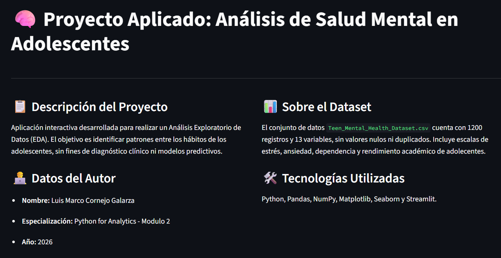

# DMC61Modulo2
# Proyecto Aplicado: Análisis Exploratorio de Salud Mental en Adolescentes

## 📝 Descripción del Proyecto
Este proyecto consiste en una aplicación web interactiva desarrollada en **Python** utilizando **Streamlit**. Su objetivo principal es realizar un Análisis Exploratorio de Datos (EDA) exhaustivo sobre el dataset `Teen_Mental_Health_Dataset.csv`. 

El aplicativo permite explorar, limpiar, transformar y visualizar datos para identificar patrones entre los hábitos digitales (uso de redes sociales, tiempo de pantalla), descanso, actividad física y variables de bienestar (estrés, ansiedad). Todo el desarrollo aplica principios de Programación Orientada a Objetos (POO) y análisis de datos con Pandas, NumPy, Matplotlib y Seaborn.

# Descripcion de Variables Principales

  Daily_social_media_hours: Horas diarias dedicadas al uso de redes sociales.
  
  Screen_time_before_sleep: Tiempo de exposición a pantallas antes de dormir (en horas).
  
  Sleep_hours: Horas de sueño por día.
  
  Physical_activity: Horas dedicadas a la actividad física.
  
  Stress_level / anxiety_level / addiction_level: Escalas del 1 al 10 que miden niveles de estrés, ansiedad y dependencia.
  
  Depression_label: Etiqueta binaria (0 = ausencia, 1 = presencia de la condición)

# Capturas de la Aplicacion

